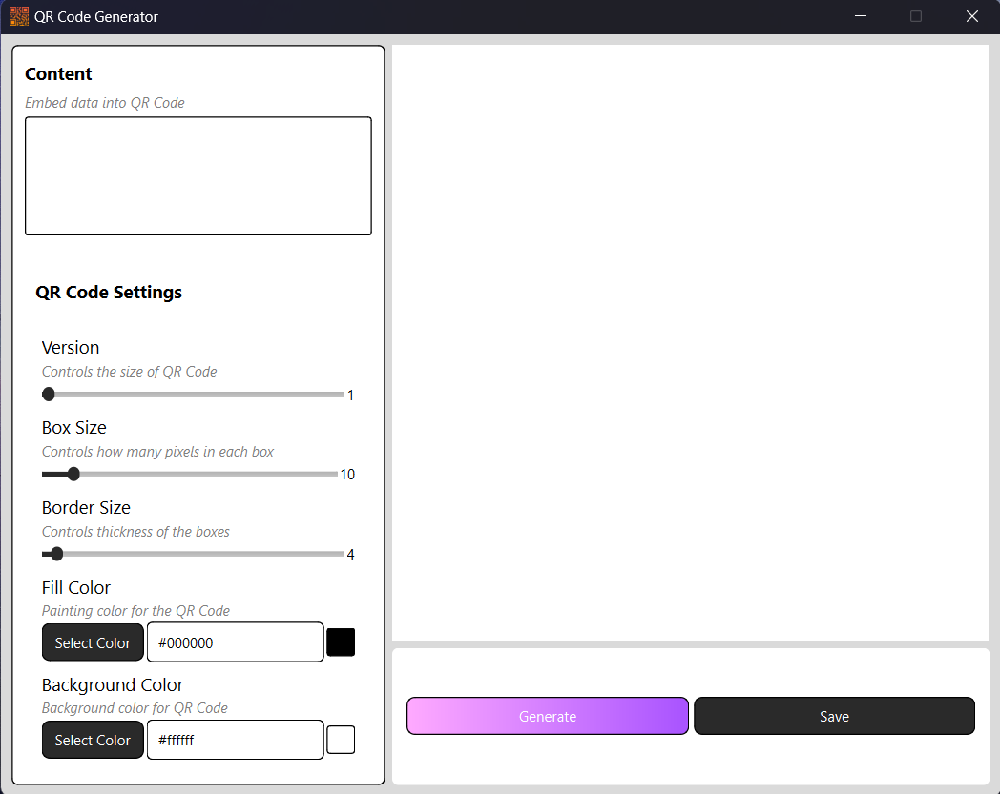
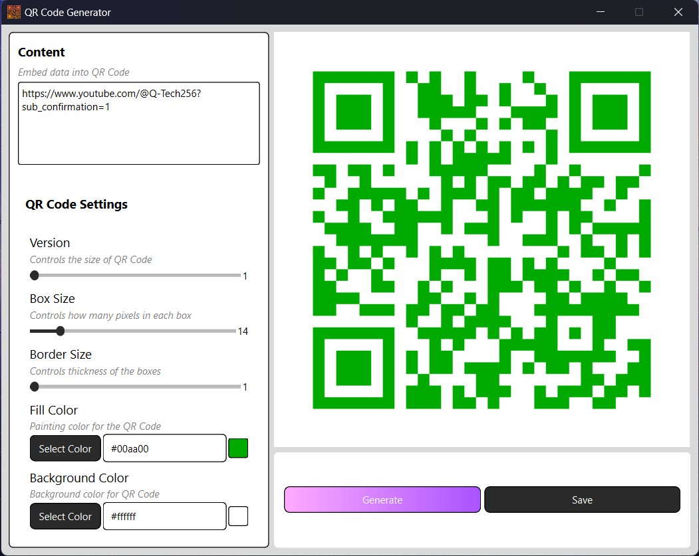

# QR Code Generator App

QR Code Generator App is a simple and intuitive desktop application designed to help you generate custom QR codes with ease. Customize colors, sizes, and styles to create QR codes for URLs, text, contact information, and more.

## Technologies Used

| Technology | Version  |
|------------|----------|
| Python     | 3.11.5   |
| PyQt6      | 6.7.0    |
| qrcode     | 7.4.2    |
| Pillow     | 10.3.0   |

## Features

- **Customizable QR Codes**: Adjust colors, sizes, and styles to fit your requirements.
- **Multiple Data Types**: Generate QR codes for URLs, text, emails, phone numbers, and contact information.
- **User-Friendly Interface**: Easy-to-use desktop app with a sleek and responsive design.
- **Preview and Save**: Preview your QR codes before saving them in various formats.

## Using The App

### Option 1: Download the Executable

1. Download the executable file from the [Releases](https://github.com/emretuncer256/qr-code-generator-app/releases) section.
2. Run the downloaded `.exe` file to launch the application.

### Option 2: Run from Source

1. Clone the repository:
    ```sh
    git clone https://github.com/emretuncer256/qr-code-generator-app.git
    ```
2. Navigate to the project directory:
    ```sh
    cd qr-code-generator-app
    ```
3. Install the required dependencies:
    ```sh
    pip install -r requirements.txt
    ```
4. Run the application:
    ```sh
    python main.py
    ```

### Application Interface

When the application launches, it should look like this:<br>
<p align="center">
  
</p>

Customize your QR code settings, enter the data, and click "Generate":<br>
<p align="center">
  
</p>

## Upcoming Features

- **Enhanced Customization**: More styling options including different shapes and patterns.
- **Batch Generation**: Ability to generate multiple QR codes at once.
- **Export Formats**: Save QR codes in additional formats such as SVG.
- **History and Logging**: Keep a history of generated QR codes and log activities.

## License

This project is licensed under the MIT License. See the [LICENSE](LICENSE) file for details.
